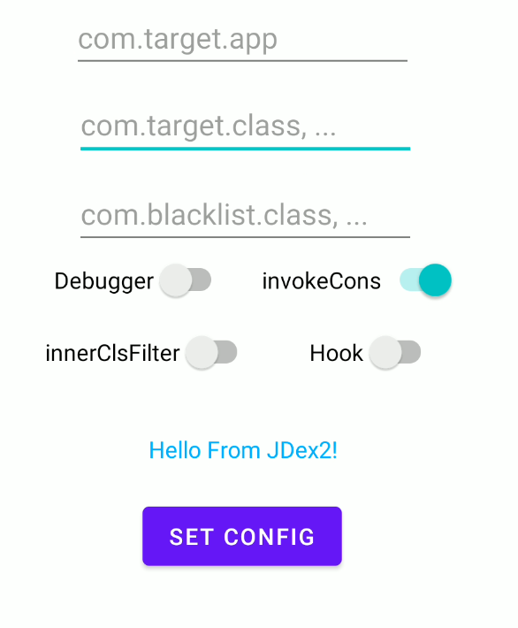
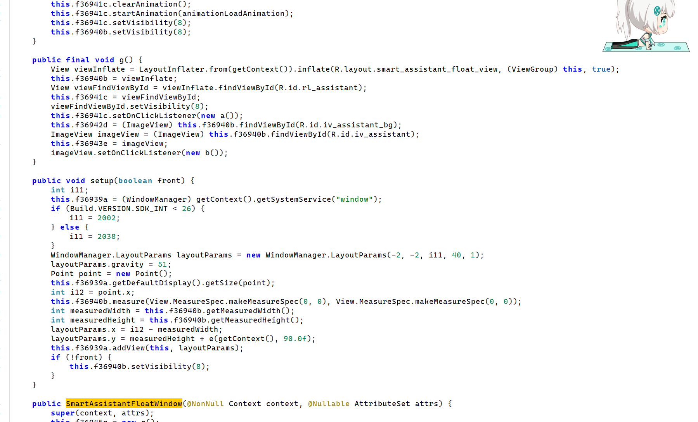

## 项目介绍

[JDex：基于Xposed / Lsposed的主动调用抽取壳脱壳工具](https://bbs.kanxue.com/thread-290669.htm)

⭐ 如果本项目对您有帮助，请点个 Star，感谢您的支持！

## 应用场景

可以应对未对Lsposed设置有效检测的大部分的企业抽取壳和免费壳的Dex加固

## 使用方法简介

以根据不同Android版本的特性，适配不同版本下配置文件写入的情况，无需Root权限

`MainActivity`中有如下配置，会根据输入将配置写到`/sdcard/Android/data/package.name/files/config.properties`路径下，也可以手动编辑，除了目标包名，其它配置多个路径可以通过`,`间隔

dump后的dex位于`/sdcard/Android/data/包名/dumpDex/`下

白名单和黑名单只是不做主动调用，但是仍然会进行dump

* targetApp：目标APP包名
* targetClass：指定要脱的壳的包路径`com.xxx`（不设置可能会导致 JNI 引用过多，通常建议以App的包名前两层作为筛选）
* blackListClass：填写某些导致App崩溃的类，如果崩溃则需要通过`JDex2 Debugger`的日志对某些类或者包进行筛选（由于写到本地性能开销过大所以没有写）
* Debugger：输出完成主动调用的类列表（`tag~=JDex2 Debugger`）
  * 当对某些APP脱壳过程中出现崩溃的情况，如果没有Dex被脱下来，需要参考主动调用的类列表进行分析，可能是因为某些Android的系统类在低版本下不存在，而APP的业务逻辑中做了定义但不会在低版本Android调用
  * 比如某APP的`com.xxx.xxx.conferencesw`包下的类继承了 Android12 才有的类
* Hook：使用Hook方式脱壳（不推荐使用）
* innerClassesFilter：由于可能导致 JNI 引用数量过多，可以尝试关闭对内部类的主动调用，但是对某些壳，脱出来的匿名类依旧是空的，按需开启，建议使用黑名单过滤而不是本配置
* **invokeConstructors：是否进行主动调用脱壳**

如果使用的是Lsposed，**记得在Lsposed中勾选对应APP**

某最新企业抽取壳脱壳效果展示：

 

## 本工具的局限性

* 只能对抗类级别的方法抽取，而基于方法粒度的抽取则会无法进行，并且无法应对方法执行结束后重新抽取的情况，还有真正开始执行字节码才动态解密的情况
* 各个方面的便捷性不足，一些崩溃问题可能需要参考崩溃日志进行分析，而且不算很完善
* 基于 Android9.0+ 开发，未适配 Android7 系列及以下，Android8未知
* JNI全局引用数量超过最大上限 51200 个导致崩溃
  * 如果类的数量过于庞大导致目标App崩溃，需要重新进行一次脱壳来重新脱剩下的类，配置无需修改，会自动识别并且跳过已经Dump的类
* 高度依赖于Lsposed的隐蔽性，如果Lsposed被检测则会直接闪退无法进行脱壳
* 对于一些继承该系统下不存在类的类的主动调用实例化可能导致崩溃，需要通过观察`invokeDebugger`的结束类去将其加入黑名单
* ~~UI写的有点草率~~